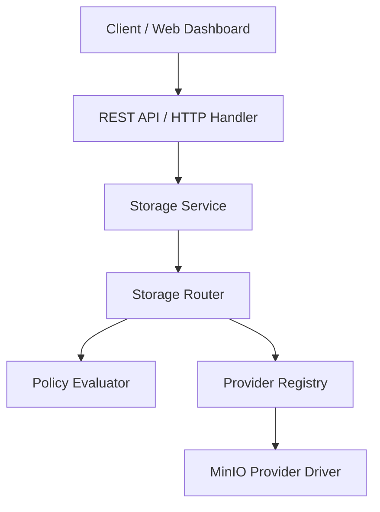

<div align="center">
  <h1>CloudStoreX</h1>
  <p><strong>The Enterprise Multi-Cloud Storage Control Plane</strong></p>
  
  [](https://goreportcard.com/report/github.com/cloudstorex/backend)
  [](https://opensource.org/licenses/MIT)
  [](https://github.com/cloudstorex)

</div>

[](https://github.com/cloudstorex/cloudstorex)
[](https://golang.org)
[](https://nextjs.org)
[](https://github.com/cloudstorex/cloudstorex/releases)
[](docs/architecture.md)

> **A policy-driven, multi-cloud storage orchestration platform that provides a unified storage control plane across multiple cloud providers.**

CloudStoreX decouples application storage logic from underlying cloud infrastructure. By routing every upload, download, and delete request through a unified Storage Domain with pluggable provider drivers and declarative policy evaluation, CloudStoreX enables multi-cloud portability, intelligent routing, and zero-vendor-lock-in storage orchestration.

---

## 🚧 Project Status

CloudStoreX is currently in **Alpha (Active Development)** — `v0.1.0-alpha`.

| Status | Milestone / Capability | Description |
|---|---|---|
| ✅ **Completed** | **Platform Foundation** | Enterprise Go monorepo, Gin, GORM, PostgreSQL, Redis, JWT auth, and structured JSON logging. |
| ✅ **Completed** | **Storage Domain** | Centralized `StorageService`, `StorageRouter`, and `PolicyEvaluator` control plane. |
| ✅ **Completed** | **Provider Abstraction** | Pluggable `StorageProvider`, `BucketProvider`, and `ObjectProvider` interfaces with thread-safe `Registry`. |
| ✅ **Completed** | **MinIO Integration** | Production-ready S3-compatible MinIO driver supporting streaming multipart I/O. |
| ✅ **Completed** | **Storage REST API** | `/api/v1/storage` endpoints for buckets & objects with standard error contracts and OpenAPI documentation. |
| ✅ **Completed** | **Web Dashboard** | Enterprise Next.js 15 (App Router) web dashboard with hierarchical folder navigation and streaming upload queue. |
| 🔄 **In Progress** | **Metadata Engine** | High-performance PostgreSQL/Redis object metadata catalog and indexing engine. |
| 🔄 **In Progress** | **Multi-Cloud Providers** | Native provider integrations for AWS S3, Google Cloud Storage (GCS), and Azure Blob Storage. |
| ⏳ **Upcoming** | **Policy Engine** | Declarative YAML-based routing rules (cost optimization, region affinity, replication). |
| ⏳ **Upcoming** | **Storage Intelligence** | Automated tiering, lifecycle policies, and deduplication analytics. |

---

## ✨ Features

- **Unified Storage Domain**: Every operation flows through a centralized `StorageRouter` and `PolicyEvaluator`—no application service ever communicates directly with MinIO, AWS, or GCP.
- **Interface Segregation**: Clean separation of `StorageProvider`, `BucketProvider`, and `ObjectProvider` for maximum extensibility.
- **Streaming Multipart I/O**: High-throughput file transfers with zero intermediate memory buffering and proactive 100 MB upload size safeguards.
- **Enterprise Authentication**: Secure JWT authentication with Argon2id/bcrypt hashing and automated Bearer token injection.
- **REST API Control Plane**: Full `/api/v1/storage` REST API with request correlation (`X-Request-ID`), structured JSON error responses, and code-generated OpenAPI specifications.
- **Modern Management Dashboard**: Built with Next.js 15, TypeScript, Tailwind CSS, shadcn/ui, TanStack Query, and Zustand—featuring filesystem-style hierarchical folder exploration, grid/table view toggles, and real-time upload progress tracking.

---

## 🏛️ Architecture

CloudStoreX implements a strict layered control plane architecture:



### Request Flow
1. **Transport Layer**: The client sends an HTTP request to `/api/v1/storage/buckets/{bucket}/objects`.
2. **Handler & Validation Layer**: Gin middleware validates JWT authentication and checks `MAX_UPLOAD_SIZE` bounds.
3. **Storage Service Layer**: Coordinates domain workflows and error translation.
4. **Storage Router & Policy Layer**: Evaluates routing policies to select the optimal target cloud provider.
5. **Provider Registry**: Retrieves the thread-safe `StorageProvider` instance from the runtime registry.
6. **Provider Driver**: Executes streaming I/O against the target backend (MinIO / S3).

---

## 📸 Screenshots

| Dashboard Overview | Bucket Explorer |
|---|---|
|  |  |

| Hierarchical Object Explorer | Streaming Upload Progress |
|---|---|
|  |  |

| Enterprise Login Shell |
|---|
|  |

---

## 🛠️ Technology Stack

| Layer | Technologies |
|---|---|
| **Backend Core** | Go (1.22+), Gin Web Framework, GORM, PostgreSQL 15, Redis 7 |
| **Storage Drivers** | Official MinIO Go SDK (`github.com/minio/minio-go/v7`), AWS SDK for Go v2 (prepared) |
| **Frontend Web App** | Next.js 15 (App Router), TypeScript, Tailwind CSS, shadcn/ui, Lucide Icons |
| **State & Fetching** | TanStack Query v5 (Server state), Zustand (Client UI & Upload queue state) |
| **Infrastructure** | Docker Compose, Multi-stage Dockerfiles, Makefile automation |
| **Quality & Testing** | Go standard `testing` + `testify` unit/integration suites, Vitest + RTL frontend testing |

---

## 📂 Repository Structure

```
cloudstorex/
├── Makefile                      # Industrial build, test, lint, and docker automation
├── docker-compose.yml            # Full local stack: PostgreSQL, Redis, MinIO, Backend, Frontend
├── README.md                     # This document
├── CHANGELOG.md                  # Semantic versioning release history (v0.1.0-alpha)
├── docs/                         # Comprehensive engineering & architectural documentation
│   ├── architecture.md           # System architecture & control plane diagrams
│   ├── storage-domain.md         # Storage Router & Policy Evaluator specifications
│   ├── provider-system.md        # Pluggable StorageProvider interface & Registry docs
│   ├── rest-api.md               # Storage REST API contracts & error responses
│   ├── dashboard.md              # Feature-oriented frontend architecture guide
│   ├── roadmap.md                # Alpha milestones and multi-cloud roadmap
│   ├── development-guide.md      # Local environment setup and debugging guide
│   ├── contributing.md           # Contribution workflow and PR guidelines
│   └── coding-standards.md       # Go & TypeScript idiomatic coding rules
├── backend/                      # Go Storage Orchestration Control Plane
│   ├── cmd/server/               # Main application entry point
│   └── internal/
│       ├── app/                  # Application container & dependency injection
│       ├── config/               # Environment-driven configuration loader
│       ├── database/             # PostgreSQL & Redis connection managers
│       ├── identity/             # User authentication & JWT service
│       ├── middleware/           # Auth, logging, CORS, and request ID middleware
│       ├── provider/             # StorageProvider interfaces, Registry, Factory, and MinIO driver
│       ├── shared/               # Structured logging, error responses, and utilities
│       ├── storage/              # StorageService, StorageRouter, and HTTP Handlers
│       └── workspace/            # Workspace domain models
├── frontend/                     # Next.js 15 Web Dashboard
│   ├── src/
│   │   ├── app/                  # Next.js 15 App Router pages and layouts
│   │   ├── components/ui/        # Reusable presentation primitives (DataTable, PageHeader, etc.)
│   │   ├── features/             # Self-contained feature modules (auth, buckets, objects, uploads)
│   │   ├── lib/                  # Axios API client and shared DTO TypeScript definitions
│   │   └── store/                # Zustand global stores (auth session)
│   └── public/                   # Static dashboard assets
├── scripts/                      # Developer automation tools (`test-all.sh`)
├── shared/                       # Cross-service schemas and OpenAPI definitions
└── docker/                       # Docker orchestration README & environment templates
```

---

## 🚀 Getting Started

### Prerequisites
- [Docker & Docker Compose](https://docs.docker.com/get-docker/) (v2.20+)
- [Go](https://go.dev/dl/) (1.22+)
- [Node.js](https://nodejs.org/) (v20+ LTS) & `npm`

### 1. One-Command Complete Stack Launch (Docker Compose)
Launch PostgreSQL, Redis, MinIO, the Go Backend, and the Next.js Frontend in a single command:

```bash
make up
```
- **Web Dashboard**: [http://localhost:3000](http://localhost:3000)
- **REST API Endpoint**: [http://localhost:8080/api/v1](http://localhost:8080/api/v1)
- **MinIO Console**: [http://localhost:9001](http://localhost:9001) (`admin` / `password123`)

### 2. Local Development Setup
To run services locally for active debugging:

#### Step A: Start Infrastructure Services
```bash
make db-up
```

#### Step B: Run the Go Backend
```bash
make run
```
The API server will listen on `http://localhost:8080`.

#### Step C: Run the Next.js Frontend
```bash
cd frontend
npm install
npm run dev
```
The development dashboard will listen on `http://localhost:3000`.

### 3. Running Automated Tests
Execute full test suites across both the backend and frontend:

```bash
make test         # Backend Go tests
cd frontend && npm test -- --run   # Frontend Vitest suite
# Or run all verification tests via helper script:
./scripts/test-all.sh
```

---

## 🗺️ Roadmap

### Current Alpha Release (`v0.1.0-alpha`)
- [x] Epic 1: Platform Foundation (Go Monorepo, Database, JWT Auth, Docker Compose)
- [x] Epic 2: Storage Domain & Provider Abstraction (`StorageService`, `StorageRouter`, `PolicyEvaluator`)
- [x] Epic 3: MinIO Provider Integration (S3-compatible driver with streaming I/O)
- [x] Epic 4: Storage REST API (`/api/v1/storage` endpoints, OpenAPI docs, Request ID correlation)
- [x] Epic 5: Web Dashboard (Next.js 15, hierarchical folder navigation, streaming upload queue)

### Next Milestones (`v0.2.0-beta` & Beyond)
- [ ] **Metadata Engine**: Dedicated PostgreSQL/Redis object catalog with custom user metadata and indexing.
- [ ] **Multi-Cloud Providers**: AWS S3, Google Cloud Storage (GCS), and Azure Blob Storage provider drivers.
- [ ] **Declarative Policy Engine**: YAML-driven intelligent routing policies (lowest-cost routing, region affinity).
- [ ] **Storage Intelligence**: Asynchronous cross-provider replication and automated cold-storage tiering.

---

## 📄 License

CloudStoreX is open-source software licensed under the [MIT License](LICENSE).
