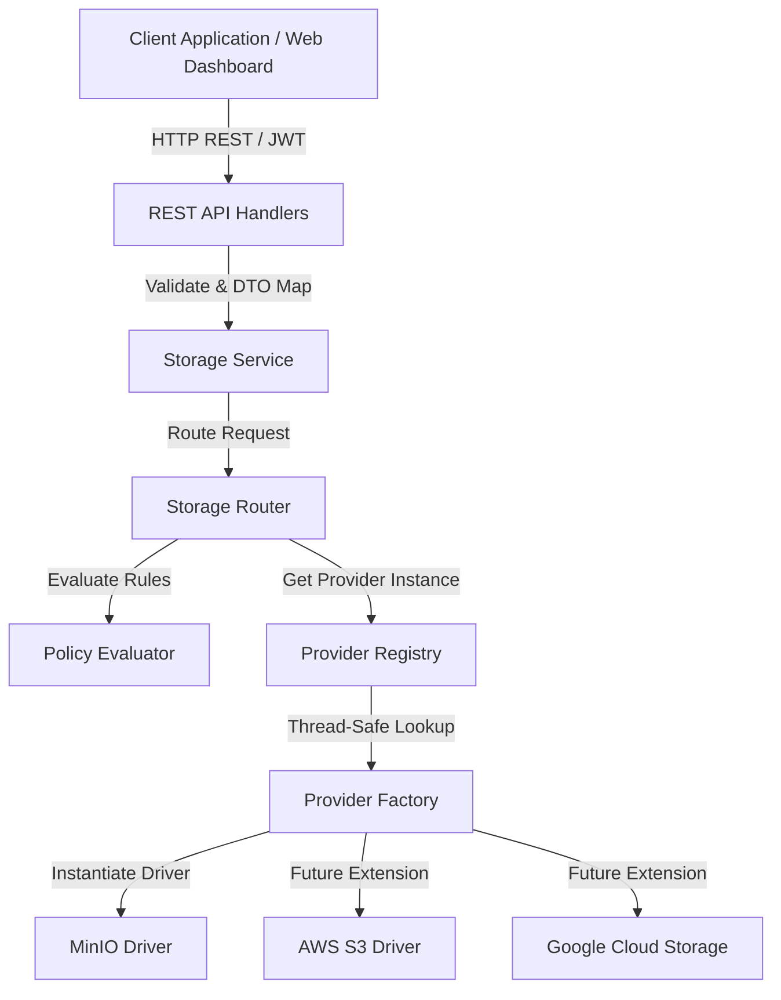

# CloudStoreX System Architecture

CloudStoreX is architected as a **policy-driven, multi-cloud storage orchestration control plane**. It decouples user application logic from underlying cloud object storage providers by routing all storage interactions through an extensible domain layer.

---

## 1. High-Level Architecture Diagram

---

## 2. Core Architectural Principles

1. **Strict Layering & Separation of Concerns**:
   - **Transport Layer (`internal/storage/handler.go`)**: Handles HTTP binding, JWT authentication, multipart stream parsing, and error translation.
   - **Service Layer (`internal/storage/service.go`)**: Coordinates storage operations and manages business rules.
   - **Router & Policy Layer (`internal/storage/router.go`)**: Isolates cloud provider selection logic from the application service.
   - **Provider Abstraction (`internal/provider/...`)**: Enforces clean interface segregation (`StorageProvider`, `BucketProvider`, `ObjectProvider`).

2. **Zero Memory Buffering for File Streams**:
   - Both upload (`UploadObject`) and download (`DownloadObject`) workflows stream `io.Reader` and `io.Writer` streams directly between the client HTTP connection and the underlying storage provider.
   - Files are never buffered into intermediate memory or disk, enabling multi-gigabyte transfers with minimal RAM footprint.

3. **Provider Agnosticism**:
   - The application database (PostgreSQL) and REST API expose unified concepts (`Bucket`, `Object`, `Policy`).
   - Adding a new cloud provider requires zero changes to the storage service or REST API handlers—only a new implementation of `StorageProvider` registered in the `Registry`.
