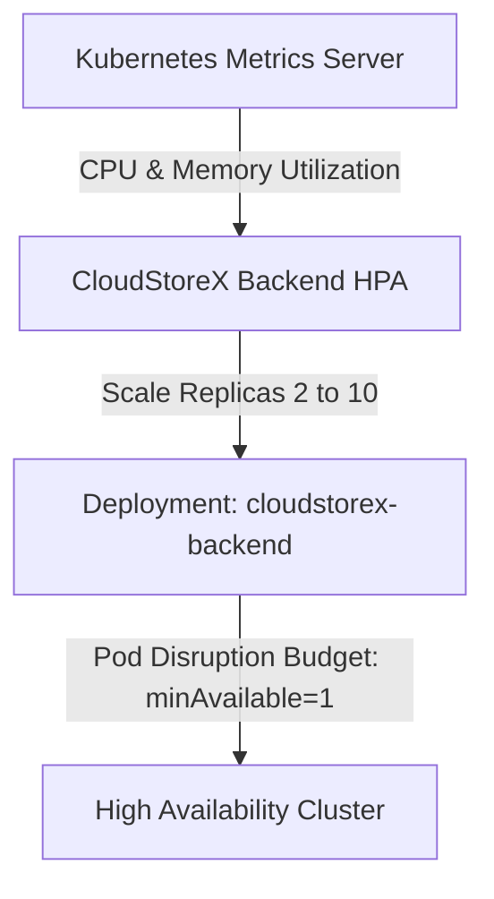

# CloudStoreX Auto-Scaling & High Availability Architecture

This document describes the Horizontal Pod Autoscaler (HPA), scale-up/scale-down policies, Pod Disruption Budgets (PDBs), and metrics server integration implemented in **Epic 11** for CloudStoreX.

---

## 1. Horizontal Pod Autoscaler (HPA) Architecture

CloudStoreX leverages `autoscaling/v2` Horizontal Pod Autoscalers to automatically adjust the replica count of the backend and frontend components based on CPU and memory utilization metrics.

### Configuration Specifications
- **API Version**: `autoscaling/v2`
- **Target Deployment**: `cloudstorex-backend`
- **Minimum Replicas**: `2` (Production / Staging default)
- **Maximum Replicas**: `10`
- **Scaling Thresholds**:
  - **CPU Utilization**: `70%` average target utilization across running pods.
  - **Memory Utilization**: `80%` average target utilization across running pods.

---

## 2. Scale-Up and Scale-Down Policies

To prevent rapid oscillation (thrashing) of pod counts during traffic spikes and transient dips, the autoscaler enforces controlled scaling behavior:
- **Scale-Up**:
  - Automatically triggers when average CPU > 70% or memory > 80%.
  - Supports rapid horizontal expansion to absorb burst storage request traffic.
- **Scale-Down**:
  - Enforces a **300-second stabilization window** (`scaleDown.stabilizationWindowSeconds: 300`) before terminating excess replicas.
  - Protects active multipart uploads and background lifecycle operations from abrupt pod termination.

---

## 3. Pod Disruption Budgets (PDB) & Zero-Downtime Upgrades

To guarantee high availability during cluster maintenance, node draining, and rolling deployments:
- **`cloudstorex-backend-pdb`**:
  - Enforces `minAvailable: 1` (or `maxUnavailable: 25%`).
  - Ensures at least one operational storage control-plane instance is active at all times, preventing API outages during cluster upgrades or voluntary evictions.

---

## 4. Prerequisites
- The target Kubernetes cluster must have `metrics-server` installed and running (`kubectl top pods` should respond with resource usage).
