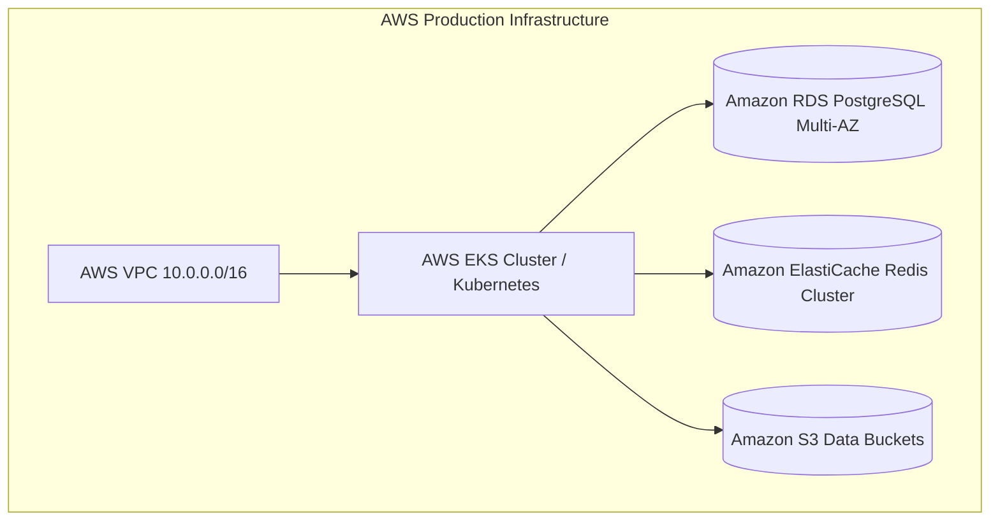

# CloudStoreX Comprehensive Deployment Guide

This guide describes how to deploy CloudStoreX across development, staging, and enterprise production environments using Kubernetes, Helm, and Terraform.

---

## 1. Environment Topology



---

## 2. Deployment Sequence

1. **Infrastructure Provisioning**:
   Use Terraform (`deploy/terraform/aws/`) to provision VPC, security groups, RDS PostgreSQL, ElastiCache Redis, S3 buckets, IAM roles, and ECR repositories.
   ```bash
   cd deploy/terraform/aws
   terraform init
   terraform apply -var-file="production.tfvars"
   ```

2. **Container Image Publishing**:
   Push the Distroless backend and static frontend images to AWS ECR:
   ```bash
   docker build -f backend/Dockerfile -t <ECR_URL>/cloudstorex-backend:latest ./backend
   docker push <ECR_URL>/cloudstorex-backend:latest
   ```

3. **Helm Application Deployment**:
   Deploy the enterprise Helm chart (`helm/cloudstorex`) pointing to the external AWS resources:
   ```bash
   helm upgrade --install cloudstorex ./helm/cloudstorex \
     --namespace cloudstorex-prod --create-namespace \
     -f deploy/helm/values-production.yaml
   ```

4. **Readiness Verification**:
   Verify that all liveness (`/healthz`) and readiness (`/readyz`) probes respond with `200 OK`:
   ```bash
   kubectl get pods -n cloudstorex-prod
   kubectl rollout status deployment/cloudstorex-backend -n cloudstorex-prod
   ```
