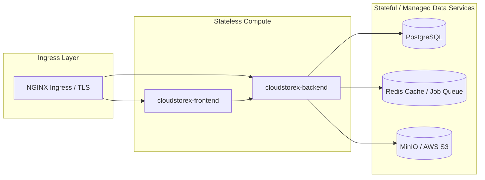

# CloudStoreX Production Kubernetes & GitOps Deployment Guide

This document covers the Kubernetes architecture, Kustomize overlays, Helm chart deployment, and GitOps integration (ArgoCD) developed in **Epic 11** for CloudStoreX.

---

## 1. Architecture Overview

CloudStoreX is designed as a cloud-native, multi-tenant storage control plane with clear separation of stateless compute (`backend`, `frontend`) and stateful data stores (`PostgreSQL`, `Redis`, `MinIO` / Object Storage).



---

## 2. Deployment Approaches

### Approach A: Kustomize (Base + Overlays)
CloudStoreX provides standard Kubernetes manifests organized under `deploy/kubernetes/`:
- `deploy/kubernetes/base/`: Contains clean, namespace-agnostic base resources (ConfigMap, Secret, ServiceAccount, Deployments, StatefulSets, Services, Ingress, HPA, PDB, NetworkPolicy).
- `deploy/kubernetes/overlays/development/`: Applies development environment patches (1 replica, reduced CPU/Memory limits, local MinIO).
- `deploy/kubernetes/overlays/production/`: Applies production environment patches (multi-replica HA, resource limits, HPA enabled).

**Deploying via Kustomize**:
```bash
# Verify overlay build
kubectl kustomize deploy/kubernetes/overlays/production

# Apply to cluster
kubectl apply -k deploy/kubernetes/overlays/production
```

---

### Approach B: Helm Chart (`helm/cloudstorex`)
The enterprise Helm chart (`helm/cloudstorex`) provides parameterized deployment management with support for optional embedded dependencies (Refinement 1):

- **Embedded Development Mode** (default):
  Deploys embedded PostgreSQL, Redis, and MinIO StatefulSets inside the Kubernetes cluster:
  ```bash
  helm upgrade --install cloudstorex ./helm/cloudstorex \
    --namespace cloudstorex --create-namespace \
    --set global.environment=development
  ```
- **Enterprise Managed Services Mode** (Production):
  Disables embedded StatefulSets and connects to external production databases and storage arrays (e.g., AWS RDS, Amazon ElastiCache, Amazon S3):
  ```bash
  helm upgrade --install cloudstorex-prod ./helm/cloudstorex \
    --namespace cloudstorex-prod --create-namespace \
    --set postgresql.enabled=false \
    --set redis.enabled=false \
    --set minio.enabled=false \
    --set externalDatabase.host="prod-db.cloudstorex.internal" \
    --set externalDatabase.username="cloudstorex_user" \
    --set externalDatabase.password="prodSecretPw" \
    --set externalRedis.host="prod-redis.cloudstorex.internal" \
    --set externalStorage.endpoint="s3.us-east-1.amazonaws.com" \
    --set externalStorage.bucket="company-cloudstorex-prod"
  ```

---

## 3. GitOps Integration (`argocd/`)
The repository is prepared for GitOps workflows using ArgoCD:
- `argocd/development.yaml`: Syncs from the `deploy/kubernetes/overlays/development` path.
- `argocd/production.yaml`: Syncs from the `deploy/kubernetes/overlays/production` path with automated pruning and self-healing enabled.

**Deploying ArgoCD Applications**:
```bash
kubectl apply -f argocd/development.yaml
kubectl apply -f argocd/production.yaml
```

---

## 4. Health & Readiness Monitoring
Kubernetes Liveness and Readiness probes automatically monitor container health:
- **Liveness Probe** (`/healthz`): Ensures HTTP server responsiveness.
- **Readiness Probe** (`/readyz`): Confirms PostgreSQL database connectivity, Redis reachability, Provider Registry initialization, Policy Engine readiness, and Background Worker availability (Refinement 7).
